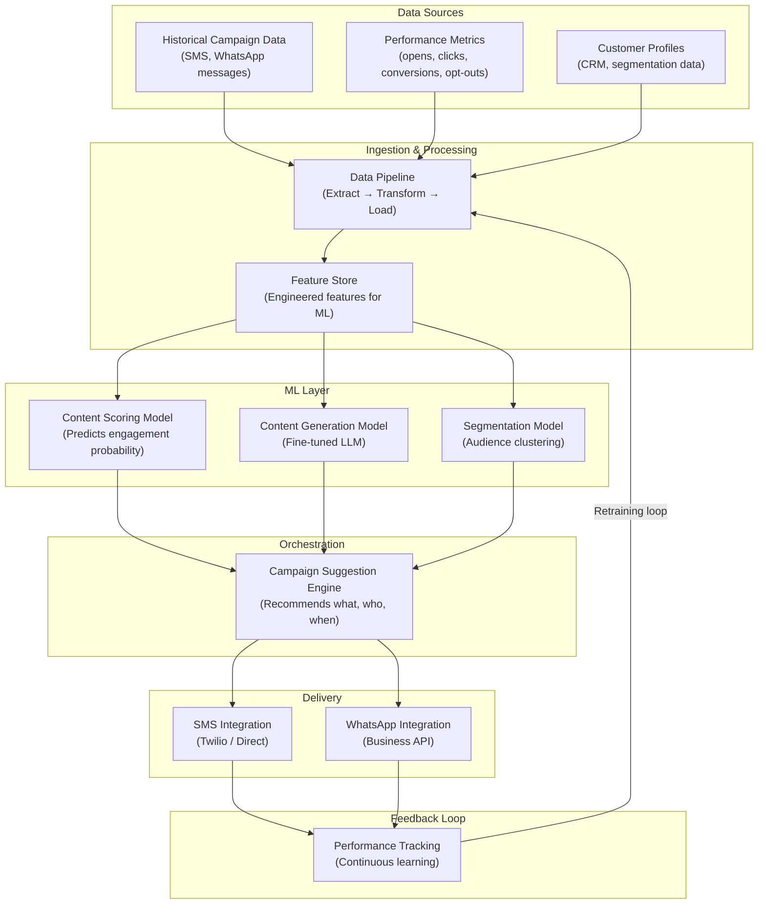
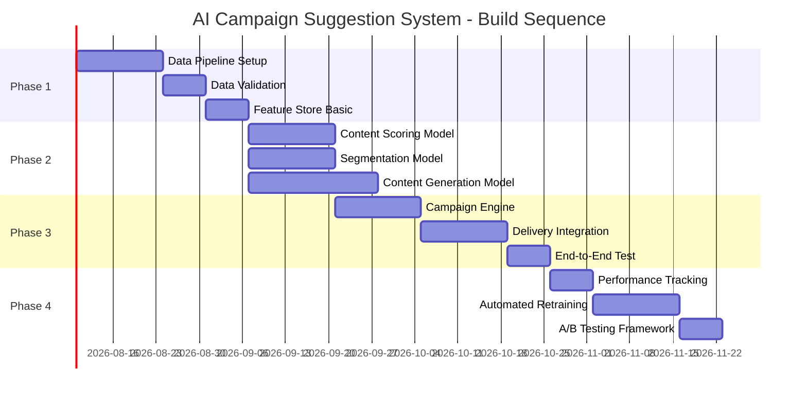

# AI Campaign Suggestion System — Architecture

**Domain:** AI-Powered Promotional Content Recommendation  
**Researched:** 2026-03-05  
**Confidence:** HIGH

---

## Recommended Architecture

This architecture follows the **hybrid approach** recommended in the market analysis — leveraging existing Customer Engagement Platforms (CEPs) while building proprietary ML models that learn from your unique historical campaign performance data.



---

## Component Boundaries

### 1. Data Sources Layer

| Component | Responsibility | Input From | Output To |
|-----------|---------------|------------|-----------|
| Historical Campaign Data | Stores past SMS/WhatsApp messages with metadata | Manual upload / API import | Data Pipeline |
| Performance Metrics | Engagement data (opens, clicks, conversions, opt-outs) | SMS/WhatsApp provider APIs | Data Pipeline |
| Customer Profiles | Customer attributes, segments, lifecycle stage | CRM / existing customer data | Data Pipeline |

**Boundary:** This layer is read-only for the ML system. It feeds the pipeline but doesn't receive logic from upper layers.

---

### 2. Ingestion & Processing Layer

| Component | Responsibility | Input From | Output To |
|-----------|---------------|------------|-----------|
| Data Pipeline | Extracts from sources, cleans, normalizes, validates | Data Sources | Feature Store |
| Feature Store | Stores engineered features for both training and inference | Data Pipeline | ML Models |

**Technology Choices:**
- **Data Pipeline:** Apache Airflow (orchestration) + Python scripts, or managed solutions like Fivetran/Windsor.ai for faster setup
- **Feature Store:** For MVP, use database tables in PostgreSQL or cloud data warehouse (BigQuery/Snowflake). Scale to Feast or Tecton when model complexity grows.
- **Validation:** Great Expectations for data quality checks

**Boundary:** This layer transforms raw data into model-ready features. It doesn't make predictions — it ensures data quality and consistency for the ML layer.

---

### 3. ML Layer

| Component | Responsibility | Input From | Output To |
|-----------|---------------|------------|-----------|
| Content Scoring Model | Predicts engagement probability for message variants | Feature Store | Campaign Engine |
| Content Generation Model | Generates promotional copy based on high-performing patterns | Feature Store | Campaign Engine |
| Segmentation Model | Clusters audiences by engagement behavior | Feature Store | Campaign Engine |

**Technology Choices:**
- **Content Scoring:** XGBoost or LightGBM for tabular engagement prediction. Start with scikit-learn, scale to Vertex AI/Bedrock for production.
- **Content Generation:** Fine-tuned LLM (GPT-4 fine-tuned on your historical messages) or smaller models like Llama fine-tuned for your brand voice.
- **Segmentation:** AutoML clustering (like Google AutoML Tables) or manual K-means with scikit-learn.

**Boundary:** These models are inference-only in the MVP. They receive features, produce predictions/generations, and return to the orchestration layer. Retraining happens offline.

---

### 4. Orchestration Layer

| Component | Responsibility | Input From | Output To |
|-----------|---------------|------------|-----------|
| Campaign Suggestion Engine | Combines all ML outputs to recommend: what to say, to whom, when | All ML Models | Delivery Layer |

**Technology Choices:**
- **CEP Integration:** Use MoEngage, CleverTap, or Braze as the orchestration layer initially (hybrid approach)
- **Custom Build:** LangGraph or CrewAI for agentic orchestration if building custom
- **RAG Pipeline:** Optional — retrieve historical high-performing messages to ground LLM generation

**Boundary:** This is the brain. It takes raw predictions and transforms them into actionable campaign suggestions. It decides priority, timing, and channel.

---

### 5. Delivery Layer

| Component | Responsibility | Input From | Output To |
|-----------|---------------|------------|-----------|
| SMS Integration | Sends SMS campaigns via provider | Campaign Engine | Performance Tracking |
| WhatsApp Integration | Sends WhatsApp campaigns via Business API | Campaign Engine | Performance Tracking |

**Technology Choices:**
- **SMS:** Twilio, AWS SNS, or direct carrier integrations
- **WhatsApp:** WhatsApp Business API (Meta), Twilio, or BSPs like Gupshup/CleverTap

**Boundary:** This layer executes the campaign. It sends and logs delivery status but doesn't decide content.

---

### 6. Feedback Loop

| Component | Responsibility | Input From | Output To |
|-----------|---------------|------------|-----------|
| Performance Tracking | Collects engagement metrics after campaign send | Delivery Layer | Data Pipeline (for retraining) |

**Boundary:** Closes the loop. Performance data flows back to the Data Pipeline for model retraining.

---

## Data Flow

### Primary Flow (Campaign Execution)

```
1. User triggers campaign suggestion request
         ↓
2. Campaign Engine requests customer segments from Segmentation Model
         ↓
3. Segmentation Model returns audience clusters
         ↓
4. Campaign Engine requests content variants from Content Generation Model
         ↓
5. Content Generation Model produces message drafts
         ↓
6. Campaign Engine requests engagement scores from Content Scoring Model
         ↓
7. Content Scoring Model returns probability predictions for each variant
         ↓
8. Campaign Engine selects best variant per segment, determines timing
         ↓
9. Campaign Engine dispatches to SMS/WhatsApp delivery
         ↓
10. Delivery confirms send status
```

### Feedback Flow (Continuous Learning)

```
1. After campaign sends, engagement data starts arriving
         ↓
2. Performance Tracking collects: opens, clicks, conversions, opt-outs
         ↓
3. At scheduled interval (daily/weekly), Data Pipeline ingests new metrics
         ↓
4. Feature Store updates with new engagement features
         ↓
5. ML models scheduled for retraining with updated data
         ↓
6. Retrained models deployed to inference layer
         ↓
7. Next campaign uses improved predictions
```

---

## Suggested Build Order

Based on dependencies, here's the recommended phase sequence:

### Phase 1: Data Foundation
**Duration:** 2-3 weeks

| Step | Component | Dependencies | Notes |
|------|-----------|--------------|-------|
| 1.1 | Data Pipeline setup | None | Extract historical messages + metrics |
| 1.2 | Data normalization & validation | 1.1 | Clean, deduplicate, schema enforcement |
| 1.3 | Feature store (basic) | 1.2 | Store computed features in accessible DB |

**Rationale:** Without clean, accessible data, nothing else works. This is the foundation for all ML models.

---

### Phase 2: Core ML Models
**Duration:** 4-6 weeks

| Step | Component | Dependencies | Notes |
|------|-----------|--------------|-------|
| 2.1 | Content Scoring Model | Phase 1.3 | Predict engagement from message features |
| 2.2 | Segmentation Model | Phase 1.3 | Cluster audiences by behavior |
| 2.3 | Content Generation Model | Phase 1.3 | Fine-tuned LLM for copy generation |

**Rationale:** These three models can be built in parallel since they all consume from the same feature store. Start simple — even basic models provide value.

---

### Phase 3: Campaign Engine Integration
**Duration:** 3-4 weeks

| Step | Component | Dependencies | Notes |
|------|-----------|--------------|-------|
| 3.1 | Campaign Suggestion Engine | Phase 2 (all) | Orchestrates models into suggestions |
| 3.2 | Delivery integration (SMS/WhatsApp) | 3.1 | Connect to providers |
| 3.3 | End-to-end test | 3.2 | Full flow from data to delivery |

**Rationale:** Build the orchestration layer after models are ready. Connect delivery at the end.

---

### Phase 4: Feedback Loop
**Duration:** 2-3 weeks

| Step | Component | Dependencies | Notes |
|------|-----------|--------------|-------|
| 4.1 | Performance tracking | Phase 3.3 | Collect engagement metrics |
| 4.2 | Automated retraining pipeline | 4.1 | Retrain models on new data |
| 4.3 | A/B testing framework | 4.2 | Compare model versions in production |

**Rationale:** Close the loop to enable continuous improvement. This is what makes your system better over time.

---

## Build Order Diagram



---

## Scaling Considerations

| Concern | MVP (0-10K customers) | Growth (10K-100K) | Scale (100K+) |
|---------|---------------------|-------------------|---------------|
| **Data Pipeline** | Python scripts + PostgreSQL | Airflow + cloud warehouse | Streaming (Kafka/Flink) |
| **Feature Store** | Database tables | Managed feature store (Feast) | Real-time feature serving |
| **Content Generation** | API calls to GPT-4 | Fine-tuned smaller model + caching | Fine-tuned model deployed |
| **Segmentation** | Batch clustering (nightly) | Near-real-time updates | Real-time segment scoring |
| **Campaign Engine** | CEP integration | Hybrid CEP + custom rules | Fully custom orchestration |
| **Delivery** | Single provider | Multi-provider with failover | Distributed delivery |

---

## Anti-Patterns to Avoid

### 1. Building ML Models Before Clean Data
**What:** Investing in sophisticated models before data pipeline is solid.  
**Why:** Models trained on dirty data produce garbage predictions.  
**Prevention:** Prioritize Phase 1 data foundation.

### 2. Hardcoding Business Rules in ML Layer
**What:** Embedding segmentation logic directly in Python scripts.  
**Why:** Loses the learning capability — rules should be in the orchestration layer.  
**Prevention:** Keep ML models pure (features in, predictions out).

### 3. No Feedback Loop
**What:** Deploying models once without retraining.  
**Why:** Performance degrades as audience behavior shifts.  
**Prevention:** Build Phase 4 feedback loop early, even if manual at first.

### 4. Skipping the Hybrid Approach
**What:** Trying to build everything from scratch.  
**Why:** Time-to-value is too slow; competitive pressure demands quick wins.  
**Prevention:** Use CEP for orchestration and delivery; build custom ML for differentiation.

---

## Integration Points

### External Systems (What Calls What)

| External System | Direction | Purpose |
|----------------|-----------|---------|
| **SMS Provider (Twilio)** | Outbound API | Campaign delivery |
| **WhatsApp Business API** | Outbound API | Campaign delivery |
| **Customer Data Platform** | Bidirectional | Enrich customer profiles |
| **Analytics Dashboard** | Outbound | Performance reporting |

### Internal System Boundaries

```
User Input → Campaign Engine → ML Models → Feature Store ← Data Pipeline
                ↓
         Delivery Layer → External Providers
                ↓
         Performance Tracking → Data Pipeline (feedback)
```

---

## Sources

- **Primary Architecture Pattern:** AI-Powered Campaign Management using MCP (Model Context Protocol) — LinkedIn Technical Leaders
- **ML Pipeline Components:** "Machine Learning Pipeline Architecture" — DSG.ai
- **Agentic Marketing Stack:** "The Agentic Marketing Stack" — Hashmeta AI Marketing Blog
- **Data Pipeline Patterns:** "Architectural Patterns for Low-Latency Marketing Pipelines" — Growth-onomics
- **Marketing ETL Best Practices:** Windsor.ai, Coupler.io
- **Feature Store Implementation:** "ML Feature Store Pipeline Using BigQuery" — OneUptime

---

## Confidence Assessment

| Area | Confidence | Reason |
|------|------------|--------|
| Component Boundaries | HIGH | Based on established patterns from CEPs (Braze, MoEngage, CleverTap) and modern ML pipeline architecture |
| Data Flow | HIGH | Standard ETL → Feature Store → ML Inference → Feedback loop pattern is well-established |
| Build Order | MEDIUM | Logical dependency chain, but actual timing depends on team expertise and data quality |
| Technology Choices | MEDIUM | Recommendations based on current SOTA, but specific tool selection should validate against team skills |
