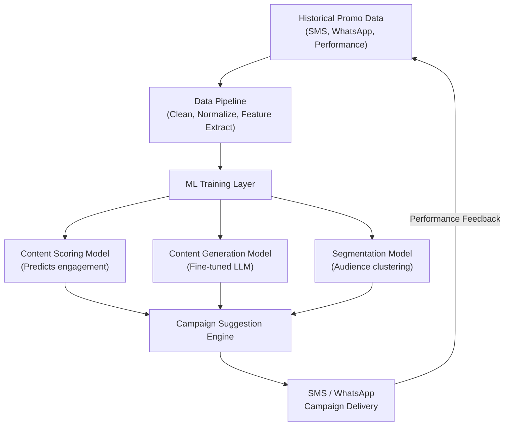

# AI Promotional Content Suggestion — Market Analysis

> **Context**: You have historical promotional data (SMS, WhatsApp messages, etc.) along with their performance & engagement metrics. This report maps the in-market solutions, how top companies use them, and where your data advantage fits in.

---

## 1. Enterprise Customer Engagement Platforms (CEPs)

These are the **most relevant category** for your use case — they ingest historical campaign data, learn from performance metrics, and generate/suggest content.

| Platform | AI Engine | Key Capabilities | Best For |
|----------|-----------|-------------------|----------|
| **Braze** | Sage AI | Item recommendations, predictive churn, send-time optimization, ML-based segmentation | Large-scale cross-channel campaigns |
| **MoEngage** | Merlin AI | Learns from past campaign engagement/CTR/conversion data; generates messaging; smart product recommendations | SMS & WhatsApp-heavy campaigns |
| **CleverTap** | Clever.AI (Predictive + Generative + Prescriptive) | AI Scribe for content tonality, real-time recommendation engine, intent-based segmentation | Mobile-first engagement |
| **Iterable** | Intelligence Suite + Nova AI Agent | Send-time/channel/frequency optimization, AI Query Summary, no-code catalog recommendations | Journey orchestration |
| **Salesforce Marketing Cloud** | Einstein GPT | Cross-channel journey orchestration, AI content recommendations, predictive lead scoring | Enterprise CRM-integrated campaigns |

### How They Use Historical Data

- **MoEngage's Merlin AI** specifically evaluates historical engagement patterns, conversion rates, and CTR to generate relevant messaging — *closest match to your data profile*
- **Braze** analyzes user behavior (purchase history, browsing) to predict product relevance and deliver real-time recommendations
- **CleverTap** forecasts business outcomes using its TesseractDB, adjusting strategies dynamically from live + historical data
- **Iterable's Nova** identifies high-value audiences, predicts conversion/churn, and suggests optimal journey paths from campaign data

---

## 2. SMS & WhatsApp-Specific AI Platforms

Platforms purpose-built for the channels you operate on:

| Platform | Focus | AI Capabilities |
|----------|-------|-----------------|
| **Attentive AI** | SMS | AI-driven message generation, predictive send-time, smart segmentation |
| **Postscript AI** | SMS (Shopify) | AI-powered subscriber growth, conversation-style campaigns |
| **Wati** | WhatsApp | Marketing automation, AI chatbots, personalized messages at scale |
| **AiSensy** | WhatsApp | Smart segmentation, auto-replies, personalized campaign templates |
| **Gupshup** | Omnichannel | Advanced API, multi-channel coverage, developer-friendly automation |
| **Yellow.ai** | Enterprise | Advanced NLP, multilingual campaign management |
| **CleverTap** | WhatsApp BSP | Official WhatsApp Business Service Provider + AI campaign engine |

---

## 3. AI Content Generation Tools

Used by marketing teams to draft/optimize promotional copy:

| Tool | Strength | Promotional Content Use |
|------|----------|------------------------|
| **Jasper AI** | On-brand content at scale | Product descriptions, marketing copy, ad variants |
| **ChatGPT / Claude** | Flexible content creation | Ideation, A/B copy variants, campaign drafts |
| **Writesonic** | Multi-model content + SEO | Content creation with built-in optimization |
| **Canva AI (Magic Studio)** | Visual + copy | Marketing graphics with AI copywriting |

> [!NOTE]
> These tools generate content but **don't learn from YOUR campaign performance data** by default. They require custom integration or fine-tuning to leverage historical engagement metrics.

---

## 4. How Top Companies Use These Solutions

| Company | Approach | Details |
|---------|----------|---------|
| **Netflix** | AI recommendation engine | Tailored content based on viewing habits; same principle applies to promotional content |
| **Amazon** | Customer behavior → product suggestions | Recommendation engine drives both product and marketing personalization |
| **Starbucks** | Predictive personalization | Uses AI to personalize offers based on purchase history |
| **Nike** | Social media AI advertising | AI-driven content + targeting for social campaigns |
| **Coca-Cola** | AI content generation | Leverages AI for creative campaign generation |
| **Unilever** | AI sentiment analysis | Filters consumer communications to understand sentiment and auto-draft responses |
| **PepsiCo** | AI creative testing | Tests creative ideas via AI + analyzes social posts for product development |

---

## 5. Key AI Capabilities That Matter for Your Data

Given that you have **historical promotional messages + performance/engagement data**, these are the most impactful AI capabilities:

### 🎯 Predictive Analytics
- Forecast which message variants will perform best
- Predict optimal send times per user segment
- Identify churn risk and trigger re-engagement

### ✍️ Generative Content Suggestions
- AI drafts promotional copy based on high-performing historical messages
- Suggests tone, length, CTAs based on engagement patterns
- Generates A/B test variants automatically

### 👥 Smart Segmentation
- AI clusters audiences based on engagement behavior
- Dynamic segments that update in real-time
- Intent-based targeting from interaction history

### 📊 Performance Learning Loop
- Continuously learns from new campaign results
- Auto-adjusts content strategy based on feedback
- Identifies creative fatigue patterns

---

## 6. Build vs. Buy Analysis

Given your historical data advantage, here's the trade-off:

### Buy (SaaS Platform)
| Pros | Cons |
|------|------|
| Faster time-to-value (weeks) | Limited customization of AI models |
| Built-in channel integrations | Vendor lock-in risk |
| Lower upfront cost | Your data enriches THEIR models |
| Proven at scale | May not fully leverage your unique data |

**Best options**: MoEngage (Merlin AI), CleverTap (Clever.AI), Braze (Sage AI)

### Build (Custom Solution)
| Pros | Cons |
|------|------|
| Full control over model training | Higher upfront investment |
| Models learn exclusively from YOUR data | Longer development (3-6+ months) |
| Competitive moat (proprietary AI) | Requires ML engineering talent |
| No vendor dependency | Infrastructure maintenance burden |

**Approach**: Fine-tune LLMs on your historical message corpus + engagement metrics → build recommendation engine

### Hybrid (Recommended Starting Point)
| Step | Action |
|------|--------|
| **Phase 1** | Use a CEP (MoEngage/CleverTap) to import your data and leverage their built-in AI |
| **Phase 2** | Build custom ML models trained on your proprietary data for content generation |
| **Phase 3** | Integrate custom models back into your CEP's workflow via APIs |

> [!IMPORTANT]
> Your **historical performance data is the key differentiator**. Off-the-shelf tools can suggest generic content — but a system trained on YOUR past message performance data for YOUR audience will significantly outperform.

---

## 7. Recommended Architecture for Your Use Case

### What Each Layer Does

1. **Data Pipeline**: Ingests your historical SMS/WhatsApp messages + engagement data (opens, clicks, conversions, opt-outs)
2. **Content Scoring Model**: Predicts engagement probability for new message variants based on historical performance patterns
3. **Content Generation Model**: Fine-tuned LLM that generates promotional content in the style/tone that historically performs well
4. **Segmentation Model**: Clusters your audience based on response patterns to different message types
5. **Campaign Suggestion Engine**: Combines all three to recommend: *what to say, to whom, and when*

---

## 8. Summary & Next Steps Recommendation

| Approach | Timeline | Cost | Data Leverage |
|----------|----------|------|---------------|
| **Pure Buy** (MoEngage/CleverTap) | 2-4 weeks | $$$$/month | Medium |
| **Pure Build** | 3-6 months | Engineering cost | Maximum |
| **Hybrid** (recommended) | 4-8 weeks initial | Moderate | High, growing |

> [!TIP]
> **Start with a hybrid approach**: Import your data into a CEP like MoEngage or CleverTap to get immediate AI-powered suggestions, while simultaneously building a custom content scoring model trained on your historical data. This gives you quick wins + a long-term competitive advantage.
